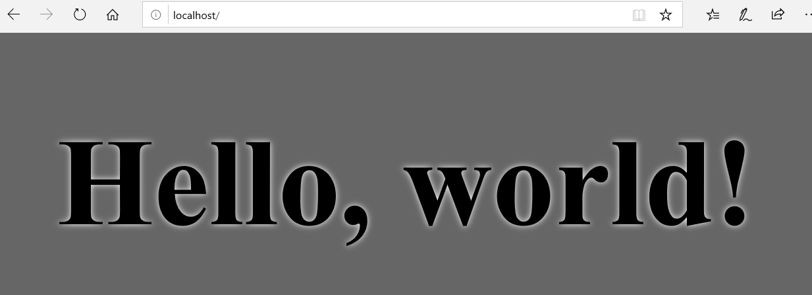
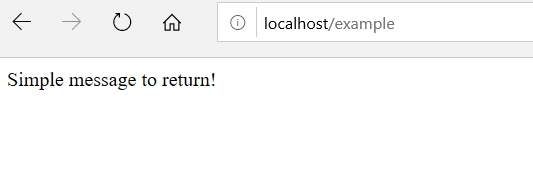

<div align="center">

# XWS
</div>

<div align="center">

[](https://www.codacy.com/manual/VGeorgee/XWS?utm_source=github.com&amp;utm_medium=referral&amp;utm_content=VGeorgee/XWS&amp;utm_campaign=Badge_Grade)
[](https://travis-ci.org/VGeorgee/XWS)
[](https://codecov.io/gh/VGeorgee/XWS)
</div>

---

<div align="center">

### Easily eXpandable Web Server

</div>


XWS is a C based cross-platform web server project, that focuses on simplifying the process of service management.

---

### Building XWS

##### Linux/MacOS:
    gcc -I ./include src/*.c -o xws

##### Windows:
    The project is uploaded as a CLion project
---

### Running XWS

The executable only has one optional argument, which is the port number you wish to start the server on (default is 80).

After starting XWS, and open `localhost` in a browser 
(or `localhost:PORT` if you added a valid port number), you should see the the following:

<p align="center">
  
</p>

---

### Managing services

In order to add a new service to XWS, you need to make 3 easy steps:

#### 1.

 create a function in `src/routes.c` 
with the following signature: `char * fnname( char *request_body)`, where fnname is your choice.

The created function must:
 - Allocate dynamic memory to handle the response
 - return the result of `parse_response(const char status_code[], char **headers, char *body)`

the `parse_response` function creates a valid response message, which XWS returns to the client.
Its parameters:
 - `const char status_code[]`  is one of the status codes from `include/status_codes.h`
 - `char **headers`  (optional) array of strings you want to add to response, NULL if omitted.
 - `char *body` body is the array you allocated,  the message you want to return to the client.

The dynamic memory you allocated is the returned respose's body.

#### 2.

You need to add your newly created function declaration to the `include/routes.h`

#### 3.
You need to add your function to the XWS driver:
 - Open `src/driver.c`
 
 The source starts with the definition of routes, and the functions in 2 array for each request type.
 You need to add your function to the array of functions, and the route to the array of routes, both to the corresponding index.
 The function name and the corresponding route name is not required to be equal.

---

### Example

Lets create a GET service that listens on the route `/example`, and returns a simple message.

1, create the function in `src/routes.c` file:
```
char *example(char *request_body){
    char *allocated_memory = malloc(1000); //allocating dynamic memory

    allocated_memory[0] = '\0'; //always ensure at least a zero length message

    strcpy(allocated_memory, "Simple message to return!"); 
// you can do anything with the body depending on the service you write

    return parse_response(STATUSCODE_OK_SUCCESS_HEADER, NULL, allocated_memory);
}
```

---

2, add your function declaration to `include/routes.h` file:
```
char *example(char *request_body);
```

---

3, add the route `"/example"` to the GET_ROUTES array, and the `example` function to the 
GET array, both to the corresponding index, and both separated with a comma in the `src/driver.c` file:

```
const char *GET_ROUTES[] = {
        "/demofunction",
        "/simple",
        "/favicon.ico",
        "/example", // <--- our route
        NULL
};
/// GET ROUTE FUNCTIONS
char * (* GET[])(char *) = {
        demofunction,
        simple_response,
        favicon,
        example, // <--- our function
        NULL
};
```

After compiling, starting XWS, and opening `localhost/example` in a browser, you should see the following:

<p align="left">
  
</p>
